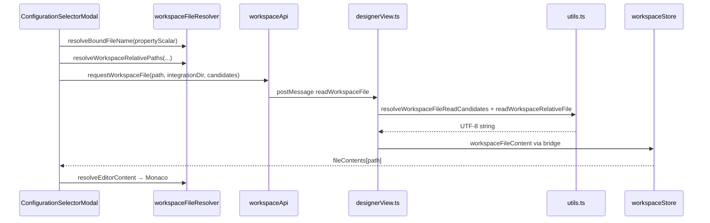

# Workspace file resolution for `resourceUri` (AI / Copilot guide)

This document is the detailed spec for extending **XKaravan** (`karavan-vscode`) so the designer **Set from → Editor** tab loads real workspace files for complex Camel `resourceUri` values—not only bare filenames like `order-transform.xslt`.

Run the shell briefing on any machine:

```bash
chmod +x scripts/copilot-workspace-resource-uri.sh
./scripts/copilot-workspace-resource-uri.sh
```

Paste the output into GitHub Copilot Chat or Cursor when starting work on a new computer.

---

## Problem statement

Camel components (xslt-saxon, freemarker, json-validator, etc.) use `parameters.resourceUri` with varied formats:

| Example | Meaning |
|---------|---------|
| `order-transform.xslt` | File next to the integration YAML |
| `transforms/order-transform.xslt` | Nested under project / integration folder |
| `file:transforms/order-transform.xslt` | Camel `file:` scheme |
| `file:{{rootDir}}/transforms/order.xslt` | Path with property placeholder |
| `classpath:com/acme/Template.xslt` | Classpath resource (not in workspace FS) |

**Today:** simple filenames next to the open `.camel.yaml` work. Values containing `{{` are ignored by `resolveBoundFileName()` and the editor shows the raw string. URI schemes are not stripped consistently.

---

## Architecture



### Integration context

When the extension opens a designer panel (`command: 'open'`):

- `relativePath` — path of the `.camel.yaml` relative to workspace root  
- `fullPath` — absolute path on disk  

`App.tsx` calls `setIntegrationContext(relativePath, fullPath)`.

The store derives:

- `integrationDir` — directory portion of `relativePath` (e.g. `integrations` for `integrations/foo.camel.yaml`)
- `integrationFullPath` — absolute path to the YAML file  

All relative file candidates should be tried **relative to `integrationDir` first**, then workspace root, then any path in `workspaceFiles` that suffix-matches.

---

## Files to change

| File | Responsibility |
|------|----------------|
| `webview/karavan/utils/workspaceFileResolver.ts` | Parse URI, placeholders, build candidate paths, editor content |
| `webview/karavan/utils/workspaceApi.ts` | `readWorkspaceFile` postMessage |
| `webview/karavan/utils/workspaceMessageBridge.ts` | Route `workspaceFileContent` to store |
| `webview/karavan/stores/workspaceStore.ts` | Cache; reject `"Buffer"` / `"[object Object]"` |
| `src/utils.ts` | `readWorkspaceRelativeFile`, `resolveWorkspaceFileReadCandidates`, security (path inside workspace) |
| `src/designerView.ts` | `readWorkspaceFile` try candidates, UTF-8 read |
| `ConfigurationSelectorModal.tsx` | Load file on open; local `editorText` state |
| `ComponentPropertyField.tsx` | `configurationSelectorSource()` scalar for modal |

---

## Critical invariants (regressions to avoid)

1. **Extension must decode bytes to string** before `postMessage`:

   ```ts
   const bytes = await readFile(normalizedAbsolute);
   return Buffer.from(bytes).toString('utf8');
   ```

2. **Webview must never display** `[object Object]`, literal `Buffer`, or serialized `{ type: 'Buffer', data: [...] }` as text. Use `decodeBinaryContent` / `ensureEditorString`.

3. **Do not use global `useCodeStore`** for modal editor text (expression objects leak in).

4. **`resolveBoundFileName` must not use `String(object)`** on DSL objects; use `coercePropertyScalar`.

---

## Proposed API (implement in `workspaceFileResolver.ts`)

```ts
export interface ResourceUriContext {
  integrationDir: string;
  integrationFullPath: string;
  workspaceFiles: string[];
  placeholders: Record<string, string>; // from propertyPlaceholders + optional props
}

export interface ParsedResourceUri {
  scheme?: string;       // file | classpath | http | ...
  path: string;          // path after scheme, before ? #
  hasPlaceholders: boolean;
  raw: string;
}

export const parseResourceUri = (raw: string): ParsedResourceUri => { /* ... */ };

export const resolvePlaceholderPath = (
  path: string,
  placeholders: Record<string, string>,
): string => { /* replace {{key}} */ };

export const buildWorkspaceReadCandidates = (
  parsed: ParsedResourceUri,
  ctx: ResourceUriContext,
): string[] => { /* ordered list */ };
```

### Scheme rules

| Scheme | Editor behavior |
|--------|-----------------|
| *(none)* or `file` | Resolve under `integrationDir`, then workspace |
| `classpath`, `http`, `https`, `ref`, `bean` | Do not read from disk; show info banner in Editor tab |
| `resource:` | Strip prefix (already partially handled via `resource:` constant) |

### Placeholders

- Source: `propertyPlaceholders` in `DesignerStore` (tuples `[key, value]`), eventually `application.properties` via extension if needed.
- If placeholders remain after resolution (`{{...}}` still in path), editor shows **read-only** raw value + short message: *"Resolve placeholders to preview file"*.
- Optional: request extension to resolve a one-off path via new command `resolveWorkspacePath` with substituted path.

### Security (extension)

`readWorkspaceRelativeFile` already rejects paths outside workspace root. Any placeholder resolution on the extension side must re-check after substitution.

---

## Test matrix

Create a minimal workspace:

```text
demo/
  app/
    routes/order.camel.yaml
    transforms/order-transform.xslt
  shared/templates/header.xslt
```

| `resourceUri` in YAML | Expected loaded file |
|-----------------------|----------------------|
| `order-transform.xslt` | `app/routes/order-transform.xslt` or `app/transforms/...` per layout |
| `../transforms/order-transform.xslt` | Resolved from `app/routes/` |
| `transforms/order-transform.xslt` | `app/transforms/order-transform.xslt` |
| `file:transforms/order-transform.xslt` | Same as row above |
| `file:{{app.dir}}/transforms/order-transform.xslt` | After placeholder `app.dir=app` |
| `classpath:transforms/order-transform.xslt` | No FS read; UI message |

Automated tests should cover `parseResourceUri` and candidate ordering without VS Code.

---

## Manual QA checklist

1. `pnpm run compile` or `npm run watch`
2. Reload Extension Development Host
3. Open integration YAML (valid Camel integration—no YAML parse errors)
4. Click gear on **Resource Uri** → **Editor** tab
5. Console: `[XKaravan] loaded workspace file: <path> (N chars)`
6. Monaco shows file content with correct language (xml for `.xslt`)

---

## Copilot starter prompt

```text
In karavan-vscode, extend workspace resourceUri resolution per
docs/COPILOT-workspace-file-resolution.md.

Implement parseResourceUri, placeholder-aware buildWorkspaceReadCandidates,
and wire ConfigurationSelectorModal + readWorkspaceFile candidates.
Support nested relative paths and file: scheme; show a clear message for classpath/http.
Add unit tests. Keep UTF-8 string reads in src/utils.ts readWorkspaceRelativeFile.
Do not break bare filename order-transform.xslt beside the integration file.
```

---

## Related extension hook (unused)

`designerView.ts` → `handleDynamicFileContent(code)` joins workspace root + `code` if it exists as a file. Consider merging with the new resolver or deleting if redundant.
